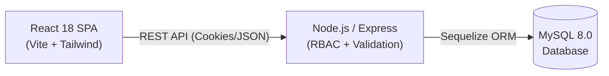
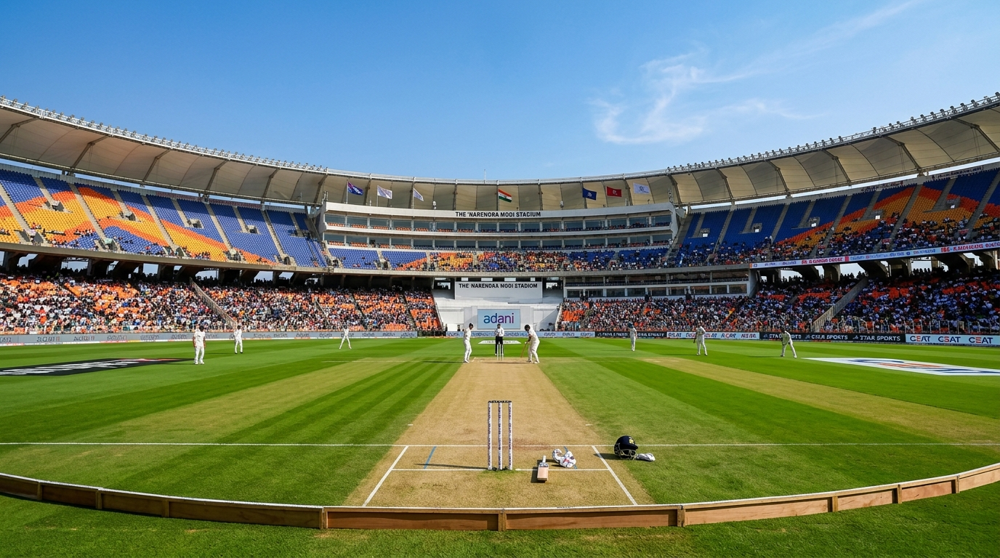
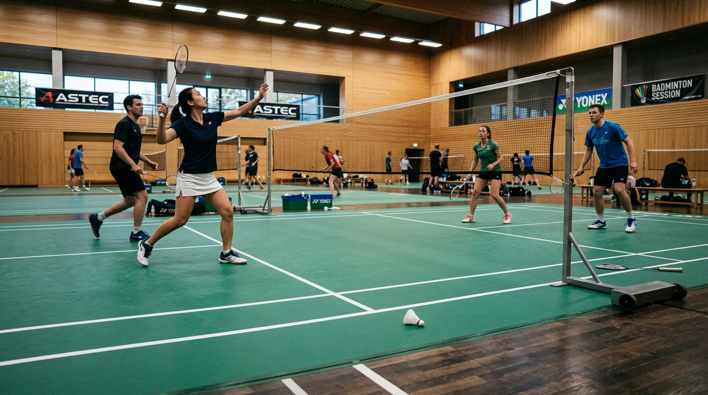
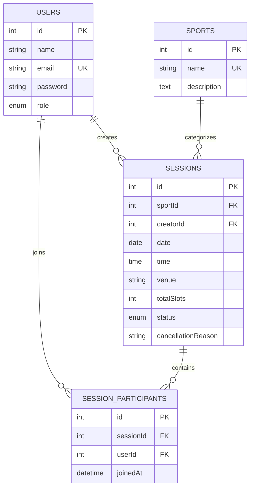

# 🏆 Sports Scheduler — Full-Stack Match & Session Management Platform

<p align="center">
  
</p>

<p align="center">
  <strong>An enterprise-grade, full-stack sports match coordination and community scheduling platform.</strong><br>
  Built with Node.js, Express, MySQL, Sequelize ORM, React 18, Vite, and Tailwind CSS.
</p>

<p align="center">
  <a href="#-tech-stack"></a>
  <a href="#-tech-stack"></a>
  <a href="#-tech-stack"></a>
  <a href="#-tech-stack"></a>
  <a href="#-tech-stack"></a>
  <a href="#-tech-stack"></a>
  <a href="#-tech-stack"></a>
  <a href="#-testing"></a>
  <a href="#-license"></a>
</p>

---

## 🌟 Overview

**Sports Scheduler** is a modern web application designed for organizing casual, amateur, and club sports sessions. Whether playing football, basketball, badminton, cricket, tennis, or volleyball, players can discover open sessions, host matches with automated capacity tracking, invite squad members, and avoid schedule conflicts.

Administrators have access to community metrics, sport catalog controls, and match moderation tools.

---

## ✨ Key Features

- **Match Scheduling**: Create sessions with sport category, venue, date/time, squad roster, and required extra players.
- **Dynamic Slot Math**: Automatic capacity calculation: `Total Slots = 1 (Host) + Roster Size + Extra Players Needed`.
- **90-Minute Conflict Engine**: Prevents players from joining or hosting overlapping sessions on the same date.
- **Session Explorer**: Multi-tab views (`Created`, `Joined`, `Available`, `All`) with sport and date filters.
- **Role-Based Access Control**: Strict separation between `PLAYER` and `ADMIN` roles across client and API routes.
- **Sports Catalog Management**: Admin catalog controls with foreign-key referential deletion protection.
- **Analytics & Reports**: Match participation rates, 30-day activity trends, and sport popularity metrics.

---

## 🏛️ Architecture



---

## 🏅 Supported Sports

<table align="center">
  <tr>
    <td align="center" width="16.6%"><br><b>Football</b></td>
    <td align="center" width="16.6%"><br><b>Basketball</b></td>
    <td align="center" width="16.6%"><br><b>Cricket</b></td>
    <td align="center" width="16.6%"><br><b>Badminton</b></td>
    <td align="center" width="16.6%"><br><b>Tennis</b></td>
    <td align="center" width="16.6%"><br><b>Volleyball</b></td>
  </tr>
</table>

---

## ⚡ Core Business Rules

| Rule | Enforcement |
|---|---|
| **Capacity Tracking** | `Total Slots = 1 (Creator) + len(Roster) + extraPlayersNeeded`. Status auto-updates to `'FULL'`. |
| **Time Conflicts** | Blocks overlapping sessions within a 90-minute window on the same date (`HTTP 409`). |
| **Past Matches** | Scheduling or joining past matches is blocked (`HTTP 400`). |
| **Duplicate Joins** | Duplicate registrations by the same user are rejected (`HTTP 409`). |
| **Cancellation** | Host or Admin only; requires a mandatory reason. |
| **Sport Integrity** | Sports referenced by existing sessions cannot be deleted (`HTTP 409`). |
| **RBAC Security** | Public signups default strictly to `PLAYER`. Admin routes reject non-admins with `403`. |

---

## 🗄️ Database Schema



---

## 📡 REST API Reference

| Module | Method | Endpoint | Access | Description |
|---|---|---|---|---|
| **Auth** | `POST` | `/api/auth/signup` | Public | Register new player account |
| | `POST` | `/api/auth/signin` | Public | Authenticate user & establish session |
| | `POST` | `/api/auth/signout` | Auth | Invalidate session cookie |
| | `GET` | `/api/auth/me` | Auth | Get current authenticated profile |
| | `PUT` | `/api/auth/change-password` | Auth | Update password |
| **Sports** | `GET` | `/api/sports` | Public / Auth | List sports with session counts |
| | `POST` | `/api/sports` | Admin | Create new sport |
| | `PUT` | `/api/sports/:id` | Admin | Update sport details |
| | `DELETE` | `/api/sports/:id` | Admin | Delete sport (safeguarded) |
| **Sessions** | `GET` | `/api/sessions` | Auth | List sessions with filters |
| | `GET` | `/api/sessions/:id` | Auth | Get match details & participants |
| | `POST` | `/api/sessions` | Auth | Create session with roster & slots |
| | `POST` | `/api/sessions/:id/join` | Auth | Join session (conflict & capacity checks) |
| | `POST` | `/api/sessions/:id/cancel` | Host / Admin | Cancel session with reason |
| **Analytics** | `GET` | `/api/analytics/player` | Auth | Personal dashboard metrics |
| | `GET` | `/api/analytics/admin` | Admin | Community & sport analytics |

---

## 🛠️ Tech Stack

- **Frontend**: React 18, Vite 5, Tailwind CSS 3, React Router v7, Axios, Lucide React
- **Backend**: Node.js, Express.js, Sequelize ORM, express-session, bcryptjs, express-validator
- **Database**: MySQL 8.0
- **Testing**: Jest, Supertest

---

## 🚀 Getting Started

### 1. Prerequisites
- **Node.js** >= 18.x
- **MySQL** 8.0 running locally

### 2. Setup Environment Files
Create environment files from the provided templates:
```bash
cp backend/.env.example backend/.env
cp frontend/.env.example frontend/.env
```
> Configure your local database and session variables in `backend/.env`.

### 3. Database Setup & Seeding
Run the database setup script to create databases, execute migrations, and seed initial data:
```bash
npm run db:setup
```

### 4. Run Development Servers
Start both services from the project root:
```bash
# Backend API (port 5000)
npm run backend

# Frontend Application (port 5173)
npm run frontend
```

---

## 🧪 Testing

Run the automated backend test suite (37 integration tests covering auth, sessions, sports, and analytics):
```bash
npm test
```

---

## 📁 Repository Structure

```
sports-scheduler/
├── backend/                        # Node.js & Express REST API
│   ├── src/
│   │   ├── config/                 # Database configuration
│   │   ├── controllers/            # Route controllers
│   │   ├── middleware/             # Auth, RBAC, and error handlers
│   │   ├── migrations/             # Sequelize migrations
│   │   ├── models/                 # Relational models
│   │   ├── routes/                 # Express route definitions
│   │   ├── scripts/                # Database setup scripts
│   │   ├── seeders/                # Seed fixtures
│   │   └── services/               # Business logic & validations
│   └── tests/                      # Jest & Supertest test suites
├── frontend/                       # React 18 & Vite SPA
│   ├── public/                     # Static assets
│   └── src/
│       ├── api/                    # API client
│       ├── components/             # Reusable UI components
│       ├── context/                # Auth context
│       ├── pages/                  # Application pages
│       └── utils/                  # Helpers
├── docs/                           # Documentation assets
└── package.json                    # Root workspace scripts
```

---

## 📄 License

Distributed under the [MIT License](LICENSE).
