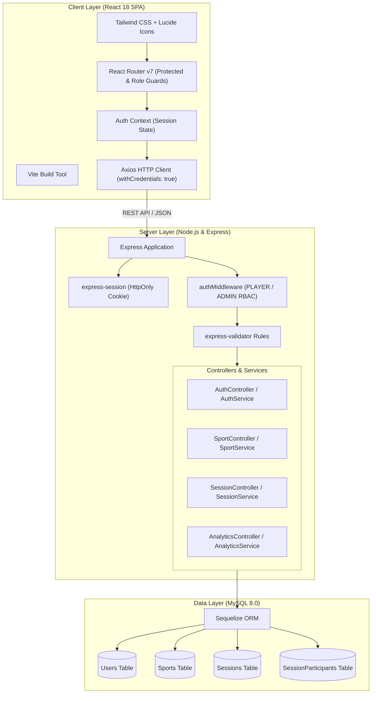
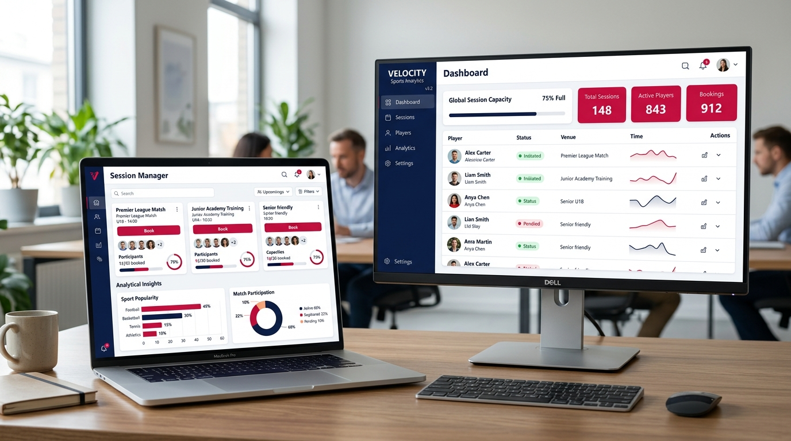
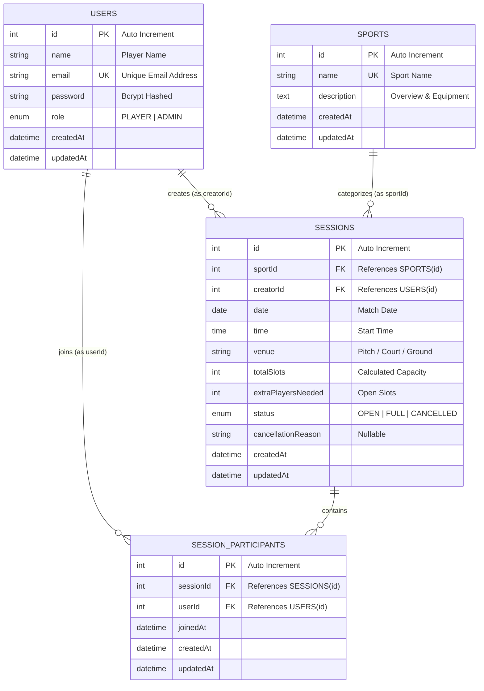

# 🏆 Sports Scheduler — Full-Stack Match & Session Management Platform

<p align="center">
  
</p>

<p align="center">
  <strong>An enterprise-grade, full-stack sports match coordination and community scheduling engine.</strong><br>
  Built with Node.js, Express, MySQL, Sequelize ORM, React 18, Vite, and Tailwind CSS.
</p>

<p align="center">
  <a href="#-tech-stack"></a>
  <a href="#-tech-stack"></a>
  <a href="#-tech-stack"></a>
  <a href="#-tech-stack"></a>
  <a href="#-tech-stack"></a>
  <a href="#-tech-stack"></a>
  <a href="#-tech-stack"></a>
  <a href="#-test-suite--quality-assurance"></a>
  <a href="#-license"></a>
</p>

---

## 📑 Table of Contents

- [Overview](#-overview)
- [Key Features](#-key-features)
- [System Architecture](#-system-architecture)
- [Visual Interface Showcase](#-visual-interface-showcase)
- [Supported Sports Catalog](#-supported-sports-catalog)
- [Core Business Rules Engine](#-core-business-rules-engine)
- [Database Schema & ER Diagram](#-database-schema--er-diagram)
- [REST API Specification](#-rest-api-specification)
- [Tech Stack](#-tech-stack)
- [Getting Started & Local Setup](#-getting-started--local-setup)
- [Test Suite & Quality Assurance](#-test-suite--quality-assurance)
- [Default Seeded Credentials](#-default-seeded-credentials)
- [Repository Structure](#-repository-structure)
- [Author & License](#-author--license)

---

## 🌟 Overview

**Sports Scheduler** is a modern, responsive web application engineered to solve the friction of organizing casual, amateur, and club sports sessions. Whether playing soccer, basketball, badminton, cricket, tennis, or volleyball, players can discover open sessions, host matches with automated capacity tracking, invite squad members, and prevent schedule overlaps. 

Administrators have access to high-level community metrics, sport catalog controls, and match moderation tools.

```
┌────────────────────────────────────────────────────────────────────────┐
│                        SPORTS SCHEDULER ENGINE                         │
├────────────────────┬────────────────────┬──────────────────────────────┤
│ ⚽ Match Discovery │ ⏱️ Conflict Guard  │ 📊 Community Analytics       │
│ 👥 Roster Builder  │ 🔒 Role Isolation  │ 🛡️ Deletion Protection       │
└────────────────────┴────────────────────┴──────────────────────────────┘
```

---

## ✨ Key Features

### 👤 For Players & Athletes
- **Intelligent Match Creation**: Form matches in seconds by choosing the sport, date, time, venue, pre-selected roster members, and required open slots.
- **Dynamic Slot Math**: Open slots calculate automatically: $\text{Total Slots} = 1 \text{ (Host)} + \text{Roster Size} + \text{Extra Players Needed}$.
- **90-Minute Conflict Prevention Engine**: Real-time validation blocks players from joining or hosting simultaneous sessions within a 90-minute window.
- **Session Explorer & Smart Filters**: Filter sessions by sport category, upcoming dates, and status (`Created by Me`, `Joined by Me`, `Available to Join`, `All`).
- **Interactive Player Dashboard**: Real-time counters showing total sessions, active matches, hosted games, and upcoming fixtures.
- **Match Cancellation Accountability**: Session hosts can cancel fixtures with a mandatory cancellation explanation visible to all confirmed participants.

### 🛡️ For Club & Platform Administrators
- **Unified Sign-In Portal**: Single authentication pipeline that dynamically routes Admins to the administrative control suite while directing Players to their personalized dashboard.
- **Sports Catalog Management**: Create, edit, and maintain sports categories with metadata and icon mappings.
- **Referential Deletion Protection**: Safety rule preventing deletion of sports tied to active or historical sessions with `HTTP 409 Conflict`.
- **Platform Analytics**: 30-day timeline charts, sport popularity distribution, player engagement rates, and community growth tracking.

---

## 🏛️ System Architecture

The platform follows clean architecture principles with clear separation of concerns across database models, services, controllers, routing middleware, and a decoupled React SPA frontend.



---

## 🖥️ Visual Interface Showcase

<p align="center">
  
</p>

### Reference Screen Flow

| # | Screen / Module | Path | Core Capabilities |
|:---:|---|---|---|
| **01** | **Landing Page** | `/` | Hero presentation, fast onboarding CTAs, feature pills, dynamic sports equipment banner. |
| **02** | **Sign In Portal** | `/signin` | Unified entry for Players and Admins, remember me, quick demo logins, sports ribbon backdrop. |
| **03** | **Registration** | `/signup` | Player self-service signup with client & server-side password strength validation. |
| **04** | **Player Dashboard** | `/dashboard` | Metric counters (*Total*, *Joined*, *Created*, *Available*), quick match joining cards. |
| **05** | **Session Explorer** | `/sessions` | Filterable sessions feed, tabbed views (`Created`, `Joined`, `Available`), sport selector. |
| **06** | **Session Creator** | `/create-session` | 2-column scheduler: sport dropdown, venue, date/time, squad roster selection, extra slot stepper. |
| **07** | **Match Details** | `/sessions/:id` | Slot status badge, creator metadata, participant avatars list, cancellation modal with reason. |
| **08** | **Sports Management** | `/admin/sports` | Admin table catalog with create modal, inline edit, and foreign-key deletion guards. |
| **09** | **Analytics Suite** | `/analytics` | 30-day match activity bar charts, sport popularity donut charts, and popularity ranking tables. |
| **10** | **Profile & Security** | `/profile` | User identity overview, role indicator badge, and secure bcrypt password change form. |

---

## 🏅 Supported Sports Catalog

Sports Scheduler supports out-of-the-box pre-configured sport profiles with tailored default player counts, venue rules, and dynamic imagery:

<table align="center">
  <tr>
    <td align="center" width="16.6%"><br><b>Football</b><br><sub>11 vs 11 Full Pitch</sub></td>
    <td align="center" width="16.6%"><br><b>Basketball</b><br><sub>5 vs 5 Half/Full Court</sub></td>
    <td align="center" width="16.6%"><br><b>Cricket</b><br><sub>Box & Turf Matchups</sub></td>
    <td align="center" width="16.6%"><br><b>Badminton</b><br><sub>Singles & Doubles</sub></td>
    <td align="center" width="16.6%"><br><b>Tennis</b><br><sub>Clay & Hard Courts</sub></td>
    <td align="center" width="16.6%"><br><b>Volleyball</b><br><sub>Indoor & Beach</sub></td>
  </tr>
</table>

---

## ⚡ Core Business Rules Engine

The backend enforces strict domain rules covered by automated tests to ensure scheduling integrity:

```
                                  BUSINESS RULES MATRIX
   ┌───────────────────────┬────────────────────────────────────────────────────────┐
   │ Rule                  │ Behavior & Enforcement                                 │
   ├───────────────────────┼────────────────────────────────────────────────────────┤
   │ 1. Capacity Calculus  │ Total = 1 (Creator) + len(Roster) + extraPlayersNeeded │
   │                       │ Auto-transitions status to 'FULL' when limit is met.   │
   │ 2. Conflict Detection │ Flags overlap if |Session_A.time - Session_B.time|     │
   │                       │ < 90 mins on identical date. Blocks with HTTP 409.     │
   │ 3. Temporal Guard     │ Creation or joining of past sessions blocked (400).    │
   │ 4. Idempotent Join    │ Duplicate joins by the same player rejected (409).     │
   │ 5. Cancellation Flow  │ Creator or Admin only. Mandatory cancellation reason.   │
   │ 6. Catalog Integrity  │ Sports referenced by sessions cannot be deleted (409). │
   │ 7. RBAC Hardening     │ Public signup cannot elevate role to ADMIN (ignored).  │
   └───────────────────────┴────────────────────────────────────────────────────────┘
```

---

## 🗄️ Database Schema & ER Diagram



---

## 📡 REST API Specification

All API endpoints return standard structured envelopes:
- **Success**: `{ "success": true, "data": { ... } }`
- **Error**: `{ "success": false, "error": { "message": "...", "code": "..." } }`

### Authentication (`/api/auth`)
| Method | Endpoint | Access | Description | Status Codes |
|---|---|---|---|---|
| `POST` | `/api/auth/signup` | Public | Register new player account (role forced to `PLAYER`) | `201`, `400`, `409` |
| `POST` | `/api/auth/signin` | Public | Authenticate user credentials and establish session | `200`, `400`, `401` |
| `POST` | `/api/auth/signout` | Authenticated | Destroy current session and clear HttpOnly cookie | `200` |
| `GET` | `/api/auth/me` | Authenticated | Retrieve current authenticated user profile | `200`, `401` |
| `PUT` | `/api/auth/change-password` | Authenticated | Update account password with old password verification | `200`, `400`, `401` |

### Sports Management (`/api/sports`)
| Method | Endpoint | Access | Description | Status Codes |
|---|---|---|---|---|
| `GET` | `/api/sports` | Public / Auth | List all active sports with associated session counts | `200` |
| `POST` | `/api/sports` | Admin Only | Add a new sport to the catalog | `201`, `400`, `403` |
| `PUT` | `/api/sports/:id` | Admin Only | Update sport name and description | `200`, `400`, `403`, `404` |
| `DELETE` | `/api/sports/:id` | Admin Only | Delete sport (prevented if referenced by sessions) | `200`, `403`, `404`, `409` |

### Session Management (`/api/sessions`)
| Method | Endpoint | Access | Description | Status Codes |
|---|---|---|---|---|
| `GET` | `/api/sessions` | Authenticated | List sessions with filters (`view`, `sportId`, `date`) | `200` |
| `GET` | `/api/sessions/:id` | Authenticated | Fetch session details, participants, and remaining slots | `200`, `404` |
| `POST` | `/api/sessions` | Authenticated | Schedule match with roster members & slot allocation | `201`, `400`, `409` |
| `POST` | `/api/sessions/:id/join` | Authenticated | Join match (checks capacity, past time, schedule conflict) | `200`, `400`, `409` |
| `POST` | `/api/sessions/:id/cancel` | Host / Admin | Cancel session with mandatory explanation | `200`, `400`, `403`, `404` |

### Analytics & Reports (`/api/analytics`)
| Method | Endpoint | Access | Description | Status Codes |
|---|---|---|---|---|
| `GET` | `/api/analytics/player` | Authenticated | Personal stats: total, joined, hosted, available | `200` |
| `GET` | `/api/analytics/admin` | Admin Only | Global stats: 30-day match trend, sport popularity | `200`, `403` |

---

## 🛠️ Tech Stack

### Frontend
- **React 18** — High-performance declarative component architecture.
- **Vite 5** — Next-generation frontend build tooling and rapid HMR.
- **Tailwind CSS 3** — Athletic crimson & navy theme design system with subtle layered borders.
- **React Router DOM v7** — Dynamic SPA routing with authenticated and role-based guards.
- **Axios** — HTTP client configured with cookie credentials (`withCredentials: true`).
- **Lucide React** — Modern, accessible SVG icon library.

### Backend & Database
- **Node.js** — JavaScript runtime environment.
- **Express.js** — Robust minimalist web framework for RESTful APIs.
- **MySQL 8.0** — High-performance relational database engine.
- **Sequelize ORM** — Structured migrations, associations, transactions, and hooks.
- **express-session & bcryptjs** — Secure stateful cookie sessions with salt-hashed passwords.
- **express-validator** — Comprehensive request sanitization and schema assertion.

---

## 🚀 Getting Started & Local Setup

### 1. Prerequisites
- **Node.js**: v18.x or higher installed (`node -v`)
- **npm**: v9.x or higher installed (`npm -v`)
- **MySQL Server**: 8.0 running on localhost:3306

### 2. Clone the Repository
```bash
git clone https://github.com/Umesh-369/Sports_Scheduler.git
cd Sports_Scheduler
```

### 3. Environment Configuration

#### Backend (`backend/.env`)
Copy the provided `.env.example` into `backend/.env`:
```bash
cp backend/.env.example backend/.env
```

Review the values inside `backend/.env`:
```env
PORT=5000
NODE_ENV=development

DB_HOST=127.0.0.1
DB_PORT=3306
DB_USER=root
DB_PASSWORD=your_mysql_password
DB_NAME=sports_scheduler_db
DB_TEST_NAME=sports_scheduler_test_db

SESSION_SECRET=sports_scheduler_super_secret_session_key_2025!
CLIENT_URL=http://localhost:5173

# Idempotent Admin Provisioning
ADMIN_EMAIL=s.umeshsaihanumaprasad@gmail.com
ADMIN_PASSWORD=Admin@123456
```

#### Frontend (`frontend/.env`)
```bash
cp frontend/.env.example frontend/.env
```
Ensure it points to the backend API:
```env
VITE_API_URL=http://localhost:5000/api
```

### 4. Database Setup & Automated Seeding
Run the database bootstrapping script from the project root. This creates both the development and test databases, executes migrations, and provisions the default administrator and mock data:

```bash
npm run db:setup
```

*(Alternatively, from inside the `backend/` directory: `npm run db:setup`)*.

### 5. Launch Development Servers

You can launch both services using the root npm commands or independently:

**Terminal 1 — Backend API**:
```bash
npm run backend
# Server runs on http://localhost:5000
```

**Terminal 2 — Frontend Application**:
```bash
npm run frontend
# Vite client runs on http://localhost:5173
```

Navigate to `http://localhost:5173` in your browser.

---

## 🧪 Test Suite & Quality Assurance

Sports Scheduler includes a comprehensive automated test suite built with **Jest** and **Supertest**, verifying all security constraints, business logic rules, and REST endpoints:

```bash
npm test
```

### Test Coverage Results (37 / 37 Tests Passing — 100%)

```
PASS tests/auth.test.js
  Authentication & Role Authorization Integration Tests
    ✓ Sequelize Admin Seeder Idempotency (2 tests)
    ✓ POST /api/auth/signup (4 tests - Role stripping, duplicate prevention)
    ✓ POST /api/auth/signin (3 tests - Admin & player auth)
    ✓ Role-based Route Authorization & 403 ADMIN_REQUIRED (3 tests)
    ✓ GET /api/auth/me (2 tests)
    ✓ POST /api/auth/signout (1 test)

PASS tests/sessions.test.js
  Sessions REST API Integration Tests
    ✓ POST /api/sessions - Create Session & Capacity Math (2 tests)
    ✓ POST /api/sessions/:id/join - Join Validations & Capacity (4 tests)
    ✓ Session Time Conflict Detection - 90 Min Overlap Guard (1 test)
    ✓ POST /api/sessions/:id/cancel - Cancellation Flow (4 tests)
    ✓ GET /api/sessions - Filters & Views (2 tests)

PASS tests/sports.test.js
  Sports REST API Integration Tests
    ✓ GET /api/sports - List with Session Counts (1 test)
    ✓ POST /api/sports - Admin creation & non-admin rejection (2 tests)
    ✓ PUT /api/sports/:id - Admin edit details (1 test)
    ✓ DELETE /api/sports/:id - Referenced Deletion Protection Rule (2 tests)

PASS tests/analytics.test.js
  Analytics API Integration Tests
    ✓ GET /api/analytics/player - Individual counters (1 test)
    ✓ GET /api/analytics/admin - Community metrics & 403 enforcement (2 tests)

Test Suites: 4 passed, 4 total
Tests:       37 passed, 37 total
Snapshots:   0 total
```

---

## 🔑 Default Seeded Credentials

Use these pre-seeded accounts for immediate testing across roles:

| Role | Name | Email | Password | Access Rights |
|:---:|:---|:---|:---:|:---|
| 👑 **Administrator** | Umesh Sai Hanuma Prasad | `s.umeshsaihanumaprasad@gmail.com` | `Admin@123456` | Full system access, sports catalog management, community analytics |
| 🏃 **Player 1 (John)** | John Doe | `john@example.com` | `Player@123` | Match creation, squad participation, personal dashboard |
| 🏃 **Player 2 (Alice)** | Alice Kumar | `alice@example.com` | `Player@123` | Match creation, squad participation |
| 🏃 **Player 3 (Sarah)** | Sarah Wilson | `sarah@example.com` | `Player@123` | Match creation, squad participation |
| 🏃 **Player 4 (Mike)** | Mike Ross | `mike@example.com` | `Player@123` | Match creation, squad participation |
| 🏃 **Player 5 (David)** | David Beckham | `david@example.com` | `Player@123` | Match creation, squad participation |

---

## 📁 Repository Structure

```
sports-scheduler/
├── .gitignore                      # Git ignore configuration for secrets & node_modules
├── package.json                    # Workspace unified management scripts
├── README.md                       # Comprehensive platform documentation
├── docs/                           # Documentation media & showcase assets
│   └── images/                     # UI previews, diagrams & sport cards
│       ├── hero-banner.jpg
│       ├── dashboard-preview.jpg
│       └── sports/
├── backend/                        # Node.js & Express REST API
│   ├── .env.example                # Backend environment template
│   ├── package.json                # Backend dependencies & scripts
│   ├── src/
│   │   ├── app.js                  # Express middleware & route registration
│   │   ├── server.js               # HTTP server listener
│   │   ├── config/                 # Sequelize DB connection setup
│   │   ├── controllers/            # Request handlers (auth, sports, sessions, analytics)
│   │   ├── middleware/             # RBAC guards, session auth, validation, error handler
│   │   ├── migrations/             # Database schema migrations
│   │   ├── models/                 # Sequelize model definitions & associations
│   │   ├── routes/                 # Express route definitions
│   │   ├── scripts/                # Database bootstrap & idempotent admin seeder scripts
│   │   ├── seeders/                # Default fixtures (admin, sports, players, sessions)
│   │   └── services/               # Business logic, conflict checks, capacity calculus
│   └── tests/                      # Jest & Supertest integration test suites
└── frontend/                       # React 18 & Vite Single Page Application
    ├── .env.example                # Frontend environment template
    ├── index.html                  # HTML entry point
    ├── package.json                # Frontend dependencies & scripts
    ├── tailwind.config.js          # Custom theme & color palette
    ├── vite.config.js              # Vite build configuration
    └── src/
        ├── App.jsx                 # Application routes & layout bindings
        ├── main.jsx                # Application root mount
        ├── api/                    # Axios API client instance
        ├── assets/                 # Graphics, icons & sport images
        ├── components/             # Reusable UI, layout & route guard components
        ├── context/                # Authentication React Context
        ├── pages/                  # 10 application pages & dashboards
        └── utils/                  # Sport card image mapping helpers
```

---

## 📄 Author & License

Developed with ❤️ by **[Umesh Sai Hanuma Prasad](https://github.com/Umesh-369)**.

Released under the **[MIT License](LICENSE)**. Feel free to use, modify, and distribute for personal or commercial projects.
